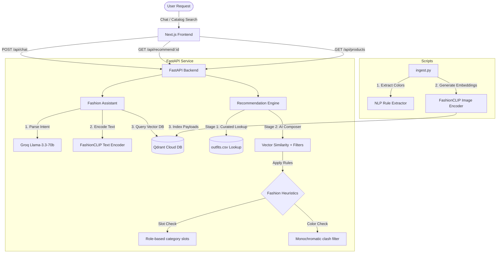

# AURA: AI Conversational Fashion Stylist & Outfit Compatibility System

**AURA** is an advanced AI-powered fashion outfit recommendation system and conversational styling assistant. It leverages multi-modal embeddings, vector search, rule-based fashion compatibility heuristics, and LLM reasoning to recommend curated and dynamically composed outfits.

Developed as a submission for the **Dare XAI AI/ML Engineer Intern Assignment**.

---

## 🎨 System Architecture

AURA is built on a modern Retrieval-Augmented Generation (RAG) and multi-modal vector search pipeline:



---

## 🚀 Key Features

### 1. Computer Vision & Multi-modal Retrieval
* **FashionCLIP Image Embeddings**: Leverages the contrastive image-text model `patrickjohncyh/fashion-clip` (512-dimensional vectors) to map visual properties of fashion products into a shared latent space.
* **Vector Database (Qdrant Cloud)**: Employs Qdrant Cloud to perform vector search with payload filters (`gender`, `category`, `occasion`) and keyword indexing to ensure rapid, sub-second product retrieval.

### 2. Two-Stage Compatibility Engine
* **Stage 1 (Curated Lookbook)**: Checks if the selected item exists in the 25 expert-curated outfit lookbook (`outfits.csv`). If a match exists, it serves the hand-crafted stylist look.
* **Stage 2 (AI-Composed Fallback)**: If no curated outfit matches the product, the system automatically builds an outfit from scratch by:
  1. Retrieving the product's image vector.
  2. Querying Qdrant Cloud for matching slots (Topwear, Bottomwear, Footwear, Accessories) using cosine similarity.
  3. Enforcing hard catalog-role boundaries.

### 3. Smart Styling Constraints
* **Gender Alignment**: Anchors the entire outfit to match the target gender (`men` or `women`).
* **Monochromatic Exception Rules**: Blocks styling items of the exact same color family (e.g. green top with green trousers) to prevent color clashes. An exception is made for **Black** and **Blue/Denim** (which style well monochromatically).
* **Occasion and Category Slots**: Dynamically determines completing pieces depending on the starting item (e.g., if starting with a shoe, it searches for a Topwear Hero first, then builds the outfit).

### 4. Conversational Fashion Assistant (Groq LLM)
* **Intent Parser**: Uses `llama-3.3-70b-versatile` to parse natural language messages (e.g., *"I'm a guy looking for a smart casual outfit for an office meeting"*) into structured JSON properties containing `gender`, `occasion`, and semantic `search_keywords`.
* **Dynamic Styling Rationale**: Generates friendly, human-like explanations explaining why the recommended outfit coordinates (focusing on color harmony and occasion appropriateness) without leaks of technical database keys.

### 5. Premium Glassmorphic Next.js UI
* **Dual-Panel Workspace**: Keeps the visual **Outfit Canvas** fixed on the right, while the left panel switches between the **AI Chat Assistant** and **Catalog Browser**.
* **Color Harmony Palette**: Splits the text color palette (e.g., `black / red`) into visual color circles mapped to matching hex codes.
* **Filterable Catalog**: Displays a zoomable grid of the 68 catalog items filterable by gender, occasion, and search keywords.
* **Live Connection Monitor**: Client-side connection polling that updates a status indicator in the header based on the backend API health check.

---

## 🛠️ Tech Stack

* **Frontend**: Next.js 16 (App Router), Vanilla CSS (Theme variables, Glassmorphism, animations).
* **Backend**: FastAPI, Pydantic, Uvicorn.
* **Database**: Qdrant Cloud (Vector DB).
* **Machine Learning**: PyTorch, Transformers (FashionCLIP).
* **LLM Orchestration**: Groq API (`llama-3.3-70b-versatile`).

---

## 📂 Project Structure

```text
ML-TASK/
├── backend/
│   ├── main.py                     # FastAPI entrypoint, mount routes, CORS
│   ├── scripts/
│   │   └── ingest.py               # Image encoding and Qdrant population pipeline
│   └── recommendation/
│       ├── assistant.py            # Conversational agent, Groq wrapper, intent parsing
│       ├── engine.py               # Two-stage compatibility engine, fashion styling rules
│       ├── test_assistant.py       # Conversational flow unit tests
│       └── test_engine.py          # Stage 1 and Stage 2 recommendation tests
├── docs/
│   └── dataset_analysis.md         # Detailed analysis of products and outfits CSVs
├── frontend/
│   ├── app/
│   │   ├── globals.css             # Vanilla CSS glassmorphic stylesheet & animations
│   │   ├── layout.js               # Page metadata & root wrapper
│   │   └── page.js                 # Dashboard layout & event handlers
│   ├── components/
│   │   ├── ChatInterface.js        # Stylist conversational interface
│   │   ├── OutfitCanvas.js         # Spotlight panel showing coordinates & palette
│   │   └── ProductCatalog.js       # Search & filter grid of catalog items
│   └── package.json
├── images/                         # Catalog product images
├── products.csv                    # Product database csv
└── outfits.csv                     # Curated looks csv
```

---

## 🚀 Setup & Execution Guide

### Prerequisites
* Python 3.10+
* Node.js 18+
* Conda / virtual environment

### Step 1: Environment Variables Setup
Create a `.env` file at the root of the workspace (`c:\Users\HP\Desktop\ML-TASK\.env`) with the following credentials:
```env
QDRANT_URL=https://your-qdrant-cluster-url.aws.qdrant.io:6333
QDRANT_API_KEY=your-qdrant-api-key
GROQ_API_KEY=gsk_your-groq-api-key
```

### Step 2: Ingest the Dataset (Optional)
If the database collection is already populated, you can skip this step. Otherwise, install the backend requirements and run the ingestion pipeline:
```bash
# Navigate to the workspace and install python dependencies
pip install -r backend/requirements.txt  # Or run in Conda env 'autoflow'

# Execute ingestion
python backend/scripts/ingest.py
```
This parses the 68 products, generates visual CLIP embeddings, and populates the Qdrant Cloud vector collection.

### Step 3: Run the FastAPI Backend Server
Start the Uvicorn server to host the API endpoints on port 8000:
```bash
# From the workspace root
python backend/main.py
```
Verify it is active by opening `http://127.0.0.1:8000/` in your browser. You should receive a JSON health confirmation.

### Step 4: Run the Next.js Frontend App
Install the frontend dependencies and launch the dev environment:
```bash
# Open a new terminal and navigate to the frontend directory
cd frontend

# Install packages
npm install

# Start Next.js development server
npm run dev
```
Open **`http://localhost:3000`** in your browser.

---

## 🧪 Verification & Testing
To verify the engine correctness offline, you can run the PyTest-style verification scripts in the backend:
```bash
# Run compatibility engine tests
python backend/recommendation/test_engine.py

# Run conversational assistant tests
python backend/recommendation/test_assistant.py
```
Both tests assert the correctness of curated retrieval, vector fallback, gender filtering, color-exception matches, and Groq JSON intent parsing.
