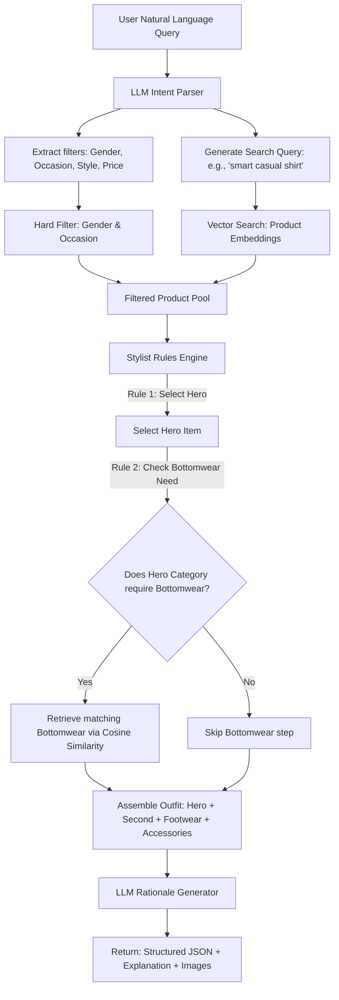

# Dataset Analysis: AI Fashion Outfit Recommendation System

This document provides a comprehensive analysis of the curated fashion dataset provided for the Dare XAI Fashion Recommendation assignment. It explores the dataset structure, metadata quality, category distributions, and details the engineering design choices required for building the retrieval and recommendation pipelines.

---

## 1. Executive Summary

The dataset consists of expert-curated fashion items and outfits designed to evaluate natural language understanding, multi-modal retrieval, and outfit recommendation logic. 

### Core Statistics
* **Unique Products**: 68 products (sourced from Ajio, Myntra, and Nykaa)
* **Expert-Curated Outfits**: 25 outfits (15 Women's, 10 Men's)
* **Product Images**: 68 images (one-to-one mapping with the 68 unique products)
  * `images/ajio/`: 28 files
  * `images/myntra/`: 28 files
  * `images/nykaa/`: 12 files
* **Image Embedding Feasibility**: Since the total count is small (68 images), embedding generation using pre-trained models like **FashionCLIP** or **SigLIP** will be near-instantaneous (sub-second) and can run in memory without complex batching.

---

## 2. Metadata Schema Analysis

The dataset is defined by two CSV files. The table below outlines the available schema, data types, and their role in the recommendation system.

### A. Product Metadata (`products.csv`)
This file contains the detailed attributes of the 68 unique fashion items.

| Column | Data Type | Missing Count | Architectural Role |
| :--- | :--- | :--- | :--- |
| `id` | String | 0 | Primary key for vector indexing and database retrieval. |
| `name` | String | 0 | Used for text embedding extraction and semantic similarity. |
| `brand` | String | 0 | Filter criteria; display attribute. |
| `price_inr` | Integer | 0 | Price constraint filtering (e.g., "outfit under 5000 INR"). |
| `rating` | Float | 25 (36.8%) | Optional quality indicator (cannot be a primary ranking key due to sparsity). |
| `rating_count` | Float | 42 (61.8%) | Popularity weight; highly sparse, used as minor boosting factor. |
| `gender` | String | 0 | Hard filter criteria (`men` or `women`). |
| `wear_type` | String | 0 | Styling partition: `western`, `ethnic`, `footwear`, `accessory`. |
| `category` | String | 0 | Key for retrieval mapping rules (e.g., `formal-shirts`, `heels`). |
| `category_label` | String | 0 | Human-readable label for UI display. |
| `occasion` | String | 0 | Hard or soft filter criteria matching user requests (e.g., `office`, `casual`). |
| `tags` | String | 0 | Semicolon-separated keywords for token search and hybrid retrieval. |
| `description` | String | 0 | Rich text used for semantic matching and LLM generation context. |
| `description_source`| String | 0 | Source indicator (`site` or `metadata`). |
| `image` | String | 0 | Relative file path to the product image on disk. |
| `site` | String | 0 | Source site (`ajio`, `myntra`, `nykaa`). |
| `product_url` | String | 0 | Direct product landing link. |
| `collected_at` | Timestamp | 0 | Metadata capture date. |

### B. Outfit Metadata (`outfits.csv`)
This file represents the ground truth for 25 stylist-designed outfits.

| Column | Data Type | Missing Count | Architectural Role |
| :--- | :--- | :--- | :--- |
| `outfit_id` | String | 0 | Unique outfit identifier. |
| `gender` | String | 0 | Filter partition for outfits. |
| `wear_type` | String | 0 | Styles classification: `western` or `ethnic`. |
| `occasion` | String | 0 | Styling context (e.g., `party`, `festive`, `wedding`). |
| `theme` | String | 0 | Stylist-assigned aesthetic theme (e.g., "Navy smart-casual"). |
| `hero` / `hero_id` | String | 0 | Primary clothing item (e.g., a dress, shirt, or kurta). |
| `second` / `second_id`| String | 12 (48.0%) | Complementary item (e.g., bottomwear). Missing for one-piece garments. |
| `layer` / `layer_id` | String | 21 (84.0%) | Outerwear / Layering item (e.g., Nehru jacket, blazer). Highly sparse. |
| `footwear` / `footwear_id`| String | 0 | Footwear item. |
| `accessory_1` / `_id` | String | 3 (12.0%) | Primary styling accessory (e.g., watch, bag, clutch). |
| `accessory_2` / `_id` | String | 21 (84.0%) | Secondary styling accessory. Highly sparse. |
| `palette` | String | 0 | Color palette representation for contrast/coordination rules. |
| `items_count` | Integer | 0 | Total items in the outfit (ranges from 3 to 5). |
| `total_price_inr` | Integer | 0 | Aggregated price of the entire outfit. |
| `image_files` | String | 0 | Semicolon-separated file paths for visual aggregation. |
| `stylist_rationale` | String | 0 | Ground-truth text for training and evaluation of explainable AI responses. |

---

## 3. Detailed Category Distribution

An analysis of `df["category"].value_counts()` reveals that the dataset does **not** use high-level, generic categories like "Topwear" or "Bottomwear". Instead, it features **47 specific fashion sub-categories** mapped under the `wear_type` and `gender` columns.

This granular classification directly impacts retrieval logic: rather than retrieving a generic "Topwear" and "Bottomwear", the system must dynamically determine the appropriate sub-category pair based on the outfit structure (e.g., pairing a `formal-shirt` with `trousers`, or recommending a single-piece `party-dress` with no bottomwear).

### Category Breakdown by `wear_type`

#### 1. Western Wear (31 Products)
* **Topwear (Hero Items)**:
  * `formal-shirts`: 3 products
  * `party-dresses`: 3 products (used as full-body Hero)
  * `casual-shirts`: 1 product
  * `party-shirts`: 1 product
  * `tshirts`: 1 product
  * `polo-tshirts`: 1 product
  * `sweatshirts`: 1 product
  * `casual-dresses`: 1 product (used as full-body Hero)
  * `activewear`: 1 product (tank top)
  * `sweaters`: 1 product
  * `tops`: 1 product
  * `maxi-dresses`: 1 product (used as full-body Hero)
  * `co-ord-sets`: 1 product (used as full-body Hero)
* **Bottomwear (Second Items)**:
  * `trousers`: 2 products
  * `jeans`: 2 products
  * `chinos`: 1 product
  * `shorts`: 1 product
  * `skirts`: 1 product
  * `leggings`: 1 product
* **Outerwear (Layering Items)**:
  * `blazers`: 1 product
  * `long-coats`: 1 product
  * `denim-jackets`: 1 product

#### 2. Ethnic Wear (7 Products)
All ethnic wear items are used as the Hero piece:
* `kurta-sets`: 2 products
* `sherwanis`: 1 product
* `wedding-sarees`: 1 product
* `sharara-sets`: 1 product
* `nehru-jackets`: 1 product (used as Layering)
* `salwar-suits`: 1 product

#### 3. Footwear (17 Products)
Footwear is essential to all outfits, with styles matching specific occasions:
* `heels`: 4 products (formal / party heels)
* `ethnic-footwear`: 4 products (traditional juttis / pumps)
* `formal-shoes`: 2 products (derby shoes, slip-ons)
* `boots`: 2 products (chunky boots, Chelsea boots)
* `running-shoes`: 1 product
* `sneakers`: 1 product
* `flats`: 1 product
* `loafers`: 1 product
* `sandals`: 1 product

#### 4. Accessories (13 Products)
Accessories are optional layering details that elevate outfit themes:
* `clutches`: 4 products
* `necklaces`: 2 products
* `handbags`: 2 products
* `watches`: 2 products
* `earrings`: 1 product
* `sunglasses`: 1 product
* `caps`: 1 product

---

## 4. Occasion Distribution

Occasion-based mapping is critical to context-aware styling. Both products and outfits are distributed across 8 primary occasions:

```
[Casual]   ■■■■■■■■■■■■■■■ (15 Products / 5 Outfits)
[Party]    ■■■■■■■■■■■■■ (13 Products / 6 Outfits)
[Office]   ■■■■■■■■■■■■ (12 Products / 2 Outfits)
[Festive]  ■■■■■■■■■ (9 Products / 4 Outfits)
[Wedding]  ■■■■■■ (6 Products / 3 Outfits)
[Sports]   ■■■■■ (5 Products / 2 Outfits)
[Winter]   ■■■■ (4 Products / 1 Outfit)
[Vacation] ■■■■ (4 Products / 2 Outfits)
```

---

## 5. Data Quality & Implementation Challenges

Developing a recommendation engine on this dataset presents unique challenges that require creative engineering:

> [!WARNING]
> ### 1. Massive Sparsity in Product Ratings
> * **Challenge**: `rating` is missing for 36.8% of items and `rating_count` is missing for 61.8% of items.
> * **Impact**: Standard rating-based filtering or collaborative filtering will fail.
> * **Mitigation**: Treat ratings as a minor, secondary boost signal when available, rather than a hard constraint.

> [!IMPORTANT]
> ### 2. Implicit "Second Item" Rules (Dresses vs. Separates)
> * **Challenge**: In `outfits.csv`, 12 out of 25 outfits have a missing `second_id` (bottomwear). These outfits are built around full-body garments (dresses, sarees, shararas, suits, and salwar sets).
> * **Impact**: A naive recommendation pipeline that always looks for `[Topwear, Bottomwear, Footwear]` will break or suggest redundant bottomwear for dresses.
> * **Mitigation**: The retrieval logic must inspect the `category` of the selected `hero` item. If the category is a single-piece garment (e.g., `party-dresses`, `wedding-sarees`, `sharara-sets`, `salwar-suits`, `suits`, `sherwanis`, `co-ord-sets`), the bottomwear retrieval step must be skipped.

> [!TIP]
> ### 3. Small Dataset Overfitting Risk
> * **Challenge**: With only 68 products and 25 outfits, we cannot train custom deep learning models (like visual recommendation networks or graphs) from scratch.
> * **Impact**: Custom-trained models will easily overfit.
> * **Mitigation**: Utilize zero-shot pre-trained embeddings (specifically **FashionCLIP** or **SigLIP**) to project text and image features into a shared vector space, performing recommendation using cosine similarity search.

> [!NOTE]
> ### 4. Brand Name Case Inconsistency
> * **Challenge**: Brand names like "ARROW" and "Arrow", or "KISAH" and "Kisah" are written with inconsistent casing.
> * **Mitigation**: Normalize all string metrics (brands, categories, occasions) to lowercase during database ingestion and user query parsing.

> [!NOTE]
> ### 5. Color Metadata Extraction and Normalization
> * **Challenge**: `products.csv` lacks a dedicated `color` column, which is essential for applying styling palettes (e.g., contrasting "navy blue" trousers with an "off-white" shirt).
> * **Mitigation**: We implement a two-stage rule-based NLP extraction system on product titles and descriptions:
>   * **Stage 1 (Text Extraction)**: Scan titles and descriptions for key color phrases using word-boundary regex.
>   * **Stage 2 (Normalization to Color Families)**: Map granular colors to normalized families (e.g., `"navy blue"`, `"sky blue"`, `"royal blue"` -> `"blue"`; `"khaki"`, `"tan"`, `"beige"` -> `"beige"`; `"gold"` -> `"gold"`; `"teal"` -> `"teal"`). If no color is identifiable, the item is marked as `"unknown"`.
>   * **Future Extensibility**: By storing both `raw_color` (e.g., `"navy blue"`) and `color_family` (e.g., `"blue"`) in Qdrant payloads, we future-proof the database for finer-grained styling rules. Dominant color extraction using computer vision could also be added.

---

## 6. Proposed Recommendation System Design

Based on these findings, we propose a **Hybrid Semantic Retrieval + Rules-Engine + LLM RAG** architecture for the FastAPI backend:



### Retrieval & Styling Logic Rules:
1. **Gender Partitioning**: Always perform hard filtering on `gender` first to match the user profile.
2. **Occasion Filtering**: Prioritize products matching the request occasion. If sparse, fall back to general style compatibility (e.g., mapping "dinner date" to a mix of `casual` and `party` items).
3. **Multi-modal Vector Representation**: Generate text embeddings for product `name` + `description` + `tags`, and visual embeddings for the product `image`. Create a hybrid vector representing both features.
4. **Compatibility Mapping**: Learn a similarity mapping from the 25 curated outfits. Given a chosen Hero item, find the nearest neighbor compatibility coordinates (representing matching colors/styles in the vector space) to retrieve the best-matching Second, Footwear, and Accessories.
